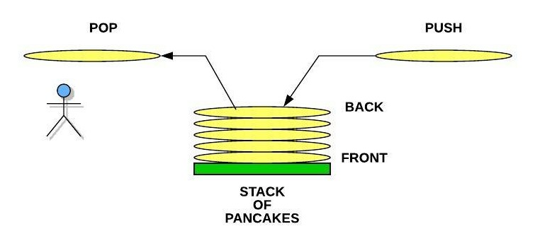

# “Fax about Stax”- The rundown about Stacks

## First glance fast explanation

 A stack is a linear data structure that stores items in a Last-In/First-Out (LIFO) or First-In/Last-Out (FILO) manner. In stack, a new element is added at one end and an element is removed from that end only. The insert and delete operations are called push and pop.

## A Neat analogy for sweet tooths and others
If you were going to make pancakes to eat, a stack of the hot pancakes on as they finished cooking. Each time we put a pancake onto the stack, that is called a push. from the analogy, we say that each new pancake goes onto the top of the stack. 

However, since we are going to implement our stacks in Python, we will say that the pancake is actually added to the back. When we take a pancake off to eat, we call this a pop operation.  The push and pop start  from the back of the stack. in short, The bottom is considered *First*. the Top is *LAST*.

Removing from the middle of the stack is not allowed and jsut can't be done in both aspects of programming and reality without it being messy. 

[Image From here](https://byui-cse.github.io/cse212-course/lesson03/pancake_stack.jpeg)

## Multiple Commands to utilize stacks, and their concepts

Stack Operation        |        Python Code           | Efficiency/Big O Notation type
---------------        | -----------------------      | --------------------------------
*push(value)*          | stack_name.append(value)     | O(1) Efficiency of adding to the end of a dynamic array
Inserts the element of your ‘value’, (whatever implemented) to the back of the stack. 
*pop()*                | value_name = stack_name.pop()| O(1) Efficiency of removing from the end of a dynamic array
Removes and returns the item from the back of the stack.
*empty()*              | if len(stack_name) == 0: return True | O(1) Efficiency of checking the size of the dynamic array
Returns the condition of the stack when it is empty, command NEEDS a boolean and if statement
*size()*               | length = len(stack_name)     | O(1) Efficiency of returning the size of the dynamic array
use the function len() to return lengths of lists. Stacks Can utlize lists. 

		

## Stack Efficiency

All of Stacks utilize the Big O Notation of O(1), mainly for pushing and popping, specifically at the end of stack, recognized as the back of the stack (which is the top, NOT bottom). 

pushing front (bottom of stack) is using O(n) because from the pancake analogy, the logic is visualized as having to pop all hotcakes IN the stack to put the one wanted first.

## Example : a Stack in action
[=> a Stack in action <=](program_example1.py)

[Back to Welcome Page](0-welcome.md)

