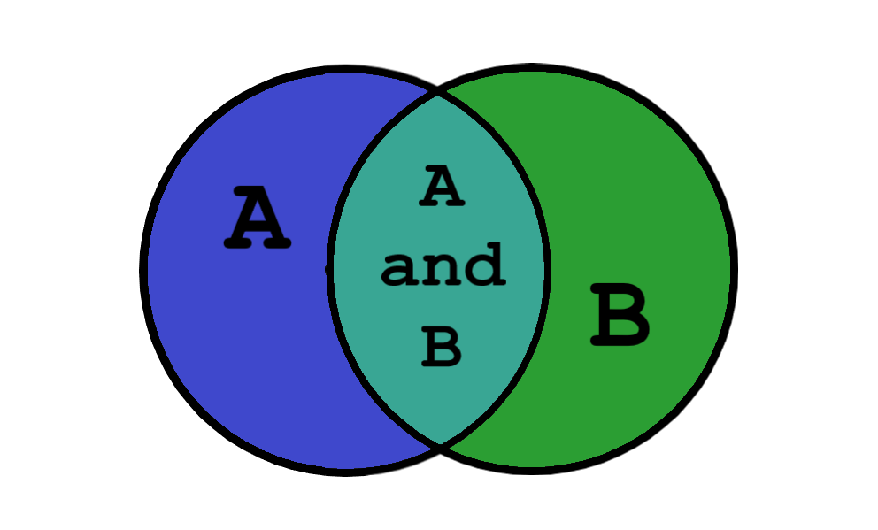

# “Be Set with Sets” – The basic layout and process of Sets
Some data structures would not necessarily worry about the order of the data. The data structure called "set" is an example of one for which order is not important. Sets do not allow duplicates. Most set implementations (including Python) will not give us an error when you try to add a duplicate value. This is done so that we can easily convert from a list, which may have duplicates, to a set that contains just the unique values.

The set does not keep values in order. a technique called *hashing*; in O(1) time, the Big O notation, the set is able to add, remove, and test for membership, See if the value one programs, is there or not. 
an index(n) hashing function  demonstartes that  the value added is not based on the order programmed.

To put in a visual perspective on the Set functionailty, The sets can be described as an actual venn diagram. Put a circle group of A and a circle group of B and push them together, Sets can read out and output the items in the ven diagrams individually and what they have in common. even to *Combining* them.

[Image From here](https://files.realpython.com/media/t.8b7abb515ae8.png)

# Commands to implement sets, and their meaning

Sets can be utilized in curly braces "{}" (my_set = {1, 2, 3}) an empty set (not like empty lists that we all know) writes out like this: "empty_set = set()". 

## Concepts of Set Operation commands

Set Operation commands |        Python Code        | Efficiency/Big O Notation type
---------------        | -----------------------   | --------------------------------
*add(value)*           | stack_name.append(value)  | O(1) Efficiency from hashing values
Adds "value" to the set	
*remove(value)*        | my_set.remove(value)      | O(1) Efficiency from hashing values
Removes the "value" from the set
*member(value)*        | if value in my_set:       | O(1) Efficiency from hashing values
Determines if "value" is in the set	
*size()*               | length = len(my_set)      | O(1) Efficiency of returning the size of set
Returns the number of items in the set	

## Set Efficiency
The Set data structure also utilizes O(1) as sets uses NO ORDER within, instead of order like Stacks. 
It is also beneficial to use its O(1) notation to check membership of values more faster. Especially since No Order is within a set. Similar with Stacks. but only slightly similar.

## Example : a Demo of Sets
[=> examples of Sets at work <=](program_example2.py)

[Back to Welcome Page](0-welcome.md)