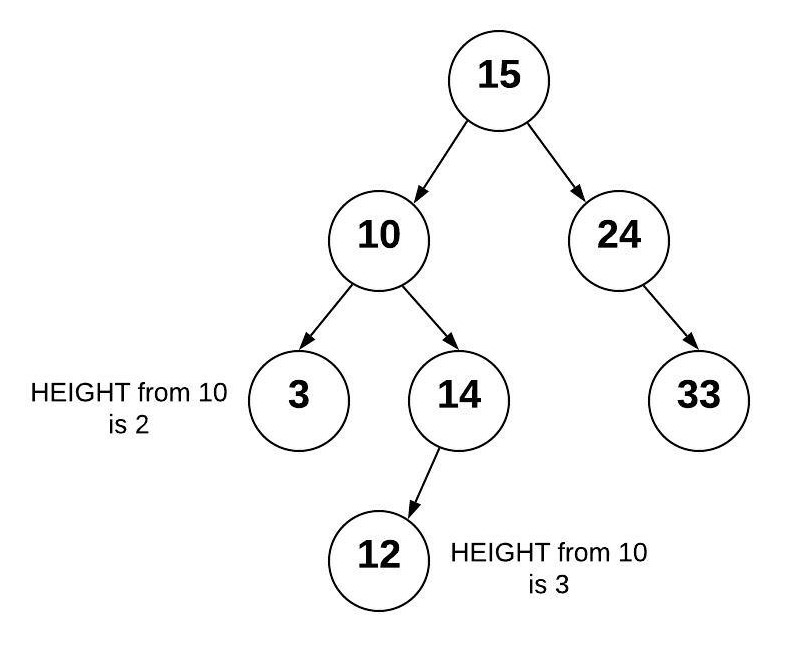

# “Being Green differently” – The paths of Binary Trees

Normal Data Trees are similar Linked Lists in that  uses nodes to connect together by pointers. A bigger Diference is that a Tree can connect to multiple different nodes. A closer look here to do is that there is a specific Kind of tree to learn about:  binary trees. 2 different "species" so to speak, are part of the Binary Tree kingdom: binary search trees and balanced and Unbalanced binary search trees.

The Binary trees kingdom can keeping data sorted, and be able to look up that data quickly, and mantains that ordering within itself.

## Binary TREE

A binary tree is a tree that links to no more than two other nodes. The Picture below demonstrates well the structure as A Binary tree gives critical structure for the SEARCH TREES, be it Unbalanced or Balanced.

[Image From here](https://byui-cse.github.io/cse212-course/lesson09/binary_tree.jpeg)

the topmost node (A) is called the root node. The nodes that connect to no other nodes, (ONLY F, G, H,I) are called leaf nodes. A node connected nodes (B) is called a parent node. The node(s) that is or are connected to the parent node are called child nodes(D & E). The nodes that are left and right of any parent node form a subtree. There is always only *one* root node. 

## Quik-fakt- the Binary SEARCH TREE
A binary search tree (BST) is a binary tree that follows rules for data that is put into the tree. But There is Comparision integrated within
it. Less Than and Greater Than Operations are utilized for traversing thru them. Data is placed into the BST by comparing the data with the value in the parent node. If the data being added is less than the parent node, then it is put in the left subtree. If the data being added is greater than the parent node, then it is put in the right subtree.

## Balanced and UNbalanced
Now moving into Balanced and Unbalanced Binary Search Trees; the main difference of a balanced one is the binary tree where the depth of the two subtrees of every node never differ by more than 1. The difference of height between any two subtrees is not dramatically different. The height of a tree can be found by counting the maximum number of nodes between root and the leaves. And uses Big O notation of O(log n). 

[Image From here](https://byui-cse.github.io/cse212-course/lesson09/avl_tree_initial.jpeg)

An Unbalanced Binary Search Tree needs to use O(n), cannot use O(log n), and acts as a linked list

[Image From here](https://byui-cse.github.io/cse212-course/lesson09/avl_tree_unbalanced.jpeg)

## Concepts of Binary Search Tree commands

Binary Search Tree commands AND **Functions** |      Description                      | Efficiency/Big O Notation type
---------------                             | -----------------------               | --------------------------------
*insert(value)*                             | Insert a value into the tree..  | O(log n) - Recursively search the subtrees to find the next available spot
*remove(value)*                             | Remove a value from the tree.  | O(log n) - Recursively search the subtrees to find the value and then remove it. This will require some cleanup of the adjacent nodes.
*contains(value)*                           | Determine if a value is in the tree.  | O(log n) Recursively search the subtrees to find the value.
*traverse_forward* (is a FUNCTION)          | Visit all objects from smallest to largest. | O(n) - Recursively traverse the left subtree and then the right subtree.
*traverse_reverse* (is a FUNCTION)          | Visit all objects from largest to smallest. | O(n) Recursively traverse the right subtree and then the left subtree.
*height(node)*                              | Finds NODE Height, not tree. height of the tree is needed, then root node is provided. | O(n) - Recursively find the height of the left and right subtrees and then return the maximum height (plus one to account for the root).
*size()*                           | Return the size of the BST.  | O(1) - The size is maintained within the BST class.

		

## Binary Search Tree Efficiency
The Big O Notation will Differ in Binary search Trees. But mainly uses O(log n), when it is a Balanced. If we had a dynamic array or a *linked list* containing sorted values, we would have an O(n) operation as we search for the proper location to insert a value into the proper sorted position. Such is the Case for an Unbalanced BST. Using the Binary Search Tree; one can able to exclude a subtree with each comparison. This ability to split the job in half recursively results in O(log n) Notation. The Balanced BST uses O(log n) also to do membership check.
it also uses O(n) to loop thru.

## Example : garden layout of Binary Trees
[=> examples of Binary Search Tree synthesis <=](program_example3.py)

[Back to Welcome Page](0-welcome.md)